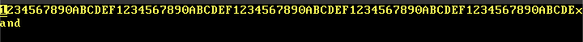

## devlog for today

so i added this devlog thing... it works! i think that in the future maybe i will refine it (add todo list and a template etc)

overall, good day.

oh, also! i added the rust binary so it can run without everything... idk where to go from here

that's all for now

goodbye o/
## how it hath been so far

soo... i think i might have messed up a bit... but im starting from scratch now (according to my father) 

TODO:
build bootloader
build file management system
make operating system
try not to go insane
realize that this will help in compsci a-levels
feel better
### continuing development of bootloader

# overall game plan B)

1. create the os
2. build bootloader for the os (?)

# TODO LIST: the creation of the os will be divided into parts, to make it easier to break down and learn.

- [ ] create the barebones kernel
    - [x] initialize the freestanding rust binary
    - [x] build the kernal
    - [x] figure out how to print text to the screen
- [ ] set up interrupts
    - [x] set up cpu exceptions
    - [x] set up double fault exceptions
    - [x] set up hardware interrupts
- [ ] set up memory management
    - [ ] implement paging
    - [ ] add heap allocation
- [ ] set up multitasking
    - [ ] async/await

#### more things, scratch notes etc

- POST normally means power on self test, which is when the computer checks if everything is as it should
- kernal will boot from bios rather than uefi
- for now, we will use bootimage thing (maybe bootloader made in the future?)
- kernal complexity and bootloader complexity are inversely proportional
- unsafe blocks should go around all memory writes

### description of each file and its usage.

lib\.rs:
- library for testing functions (basically a testing crate) 

main\.rs
- where the main code is stored (it's the file which is actually run) 

serial\.rs
- this is where the code for printing things to the console is.

vga_buffer.rs
- this is where the code for writing to the screen is. 
### starting work on exceptions and interrupts now

the interrupt descriptor table should have a life as long as the code (in this case, the operating system)
- for this reason, we use a lazy static when we declare the interrupt descriptor table (outside of the init function).
- then, we just have IDT.load() in the init func instaed of declaring it inside the init func.

update: 22:48:28:
why isnt the interrupt test workinggggggggg

update: 22:50:05:
it was because i hadn't initlaized the test function so it didn't do anything <33333333
note to self: make sure to initialize things.

update: 22:56:10:
added interrupts for breakpoint
i have to add all the other ones, and also implement double faults.
this is because if double faults dont work then triple faults will hjappen
these are not good.
notes for today:

if we see this:
```
Error: panicked at 'assertion failed: `(left == right)`
left: `'.'`,
right: `'S'`', src/vga_buffer.rs:205:9
```

we have to keep WRITER locked for the duration of whatever is happening.
so, wrap it in this: 
```
interrupts::without_interrupts(|| {
    //code goes here
});
```
and declare the `lock()` method explicitly: 
```
let mut writer = WRITER.lock(); 
writer.buffer.chars[bar]
```

instead of 

```
let foo = WRITER.lock().buffer.chars[bar]
```
### notes for today

for the cursor, i think the idea is that:
    1. we get the foreground and background color of the square
    2. we invert it

done. because that's how it normally works!
probably remove the colorcode type... maybe set colorcode and stuff to just a fg: Color and bg: Color then declare colorcode itself seperately?
### ideas for today

- got the backspace working alright (was overcomplicating  hings)
- going to try to do the same thing with arrow keys now
- the variable "self.text_position" in vga_buffer is the index of the text on the screen.### ideas for today

- ~~if col + 1 > buffer width, grab that character in col and move to next line + col 0.~~ this was wrong. just do it reversed. all reversed
- # devlog for today

### notes on what i'm currently doing 

20:01

finally started back on the project after a week-ish long hiatus. this allowed me time to gather my thoughts and appropriately plan for my next steps.

i am working on the `move_chars` function in `src/vga_buffer.rs`, which handles the moving of characters when the index of cursor position is not equal to the index of the text position.

the function should be called when this condition is satisfied, and: 
- on backspace (to move the characters left) 
- on keyboard input (to move the characters right)

**<u>updates</u>**

20:42
- still working on `move_chars`. figuring out where and when to change `cursor_position` and `column_position`

22:21
- took a short break (made tea yum)
- undid deletion of `delete_byte`... that works fine as is, and should probably make changes in `move_chars`

22:54
- edited `delete_byte` to move stuff after character is deleted.
- the problem lies in `delete_byte`: i have to figure out when to change `self.text_row`

23:05 
- starting implementation of an `if` statement to change `self.text_row` when `self.text_column` = 0.    
this should allow me to make `move_chars` work, at least to move them left.

23:47
- changing `self.text_column` implementation, since i designed it wrong.
- i should probably sleep soon...


#today's notes
00:06
ahahahahaha it is the next day...
i'm gonna sleep. see you in the morning!

11:31
- it is the morning now.

15:07
- it is the afternoon, starting now.
- a brief recap from yesterday:
    - i left off working on the implementation of `self.text_column`.
    - after this is done, i'll continue working on `delete_byte`.

15:30
- giving up on re-implementing `self.text_column`, just gonna change name to `self.write_column`
- for unity `self.text_row` is now `self.write_row`

15:56
- single row deletion works when there is a cursor offset now
# hi.

continuing work on moveleft deletion; almost done just need it to cross-line

22:30:
maybe i should use debugging more ngl

22:37
starting configuration of debugger

23:36
breakpoints kinda work

11/04/2023
09:52
good morning... it's the next day. I've figured out how to use gdb!
now i'm working with the for loops in `move_chars`, specifically the ones dealing w columns

10:10
I think i have a solution.
I've separated the `direction == 0` condition into two statements.
one handles the moving if there is no `row` offset (essentially, when the moving text is only on 1 line), and the other handles text movement if the block of text goes across multiple lines.
i've also increased the ranges which end with `self.write_column` by 1 so that the last character is deleted (yay) (lines 107 and 114)

10:17
to debug with gdb, run `gdb -ex 'file target/x86_64-sketchOS/debug/sketch_os'`, which auto-runs the file (saves time i swear)

10:24
found an error (thank you gdb)
the first if statement breaks if the column = 0 (i didn't add a condition to handle that)
fix:
added 
```
if col == 0 {
    self.buffer.chars[row-1][BUFFER_WIDTH-1].write(character);
}
```
at vga_buffer.rs:109

10:34
tried to setup dap again and it DOESN'T WORK OF COURSE
gonna take a break

10:49
ok i took a break

10:59
added a script debug.sh which debugs program

11:14
finalized the script :)

12:22
an error on line 107:
i added an additional condition `self.write_column == 0`; moving it to seperate if statement as it needs to be handled seperately

12:49
deletion works now backwards...

15:51
went gym B)
move_chars <- works, committing and pushing
# for today
working on move_chars right

16:00
starting

16:03
i'm going to quickly make a program to reverse cursor_col

17:22
man this is tough

19:36
stoppingnow bc homework
#hey there

oh yeah im working on a cursor
#hey there :)

#cursor implementation is FINISHED

18:58   
resuming arrow movement implementation.

19:01   
never mind it's done i guess
gonna start work on character movement ->
should be pretty straightforward - just need to copy move_chars <-

21:47   
yeah i have no clue why it's not working

21:54    
ok i figured it out:
basically, when we move the byte down to the new line
```
if self.cursor_column >= BUFFER_WIDTH {
    self.new_line();
}
```

it calls this fn
```
fn new_line(&mut self)
```

which does this
```
self.cursor_column = 0;
self.write_column = 0;
```
this works fine when we're typing normally, but if there's a cursor offset, the cursor position will just write over this character (why?)

fix attempt 1:
```
if self.cursor_column != self.write_column {
} else {
    self.cursor_column = 0;
    self.write_column = 0;
}
```

doesn't work because we increase row height here
```
else {
    self.cursor_row += 1;
    self.write_row += 1;
}
```

without doing anything to the cursor column; therefore its value becomes 81 (uh oh)

22:25    
scrapping this solution, should be handling line movement in the move_chars fn anyway

2023-11-11   
11:09   
i'm gonna try and work on some stuff today! 
i put all devlogs into a central 'devlog' file so its easier to read through and actually practically use

11:22   
move chars -> works fine on a single line, but for some reason it's overwriting the stuff on the next line and i have no clue why...   

**debug notes:**    
when col is 80:
cursor coords: (0, 80)   
write_col: (1, 3)
   
**end debug notes**

because of 
```
match byte {
    b'\n' => self.new_line(),
```
the problem is probably in `new_line()`.

11:51   
i was right.
problem is in 
```
else {
    self.cursor_row += 1;
    self.write_row += 1;
}
```
problem: write row shouldn't be incremented if it's greater than self.cursor_row => there's an offset.

fix: implement a check to see if write_row is > cursor row.   
if false, increment.

15:51
ok so i may have spent a while making it so that i can add custom breakpoints usinga  file
that's ok tho

16:01
working fully now i think...
the implementation wasn't horrible
```diff
         else {
-            self.cursor_row += 1;
-            self.write_row += 1;
+            if self.write_row <= self.cursor_row {
+                self.write_row += 1;
+            }
+            self.cursor_row += 1; //move cursor to next line
         }
-        self.clear_row(BUFFER_HEIGHT - 1);

-        self.cursor_column = 0;
-        self.write_column = 0;
+        self.cursor_column = 0; //put cursor at the beginning of this line
+        if self.write_column <= self.cursor_column { // if false, we are behind the write_column
+            self.write_column = 0;
+        }
```

i'm probably going to start working on a basic cli now.
i'm thinking something like
```
user@workspace>> hey
```
and then when we add file management, i can actually set the values of user and workspace to something

18:10
kinda struggling with this lmao concatenating strings is tough when you don't have a std;

2023-11-26
22:37
prompt works aok.  
starting work now on making the prompt immune to deletion...  

2023-11-27
22:05
working again on the safe delete thing in `prompt.rs`   
i think i have a main idea on how i'm going to solve this problem:   
- redo the entire vga_buffer thing
maybe tomorrow...

2023-11-29   
22:27   

ok it's late but i've made some notes on how i'm going to restructure `vga_buffer.rs`


### functions needed
- `write_string` (for `print` and `println`)
- `clear_row` (for clearscreen)
- `delete_byte` (for backspace)
- `move_cursor` (for cursor movement)
- `shift_screen` (for shifting the screen up or down)
- `flip_cursor` (for drawing a cursor to the screen)
- `move_chars` (for line movement)

2023-11-30
21:33

shift screen notes
```rust
fn shift_screen(direction: Direction) {
    /* DOWN */
    for row in 1..BUF_H {
        for col in 0..BUF_W {
            char = buffer[row][col].read();
            write char to [row-1][col];
        }
    }

    /* UP */
    for row in (0..BUF_H-1).rev() {
        for col in 0..BUF_W {
            char = buffer[row][col].read();
            write char to [row+1][col];
        }
    }
}
```
this is how i'm planning to implement this fn

2023-12-02
20:42

some more work, specifically on ```move_cursor()```

for directions up and down, we want an if statement before to check if the cursor is at the very top/bottom, and to shift the screen if it is.  
good thing i have a function for that :)

